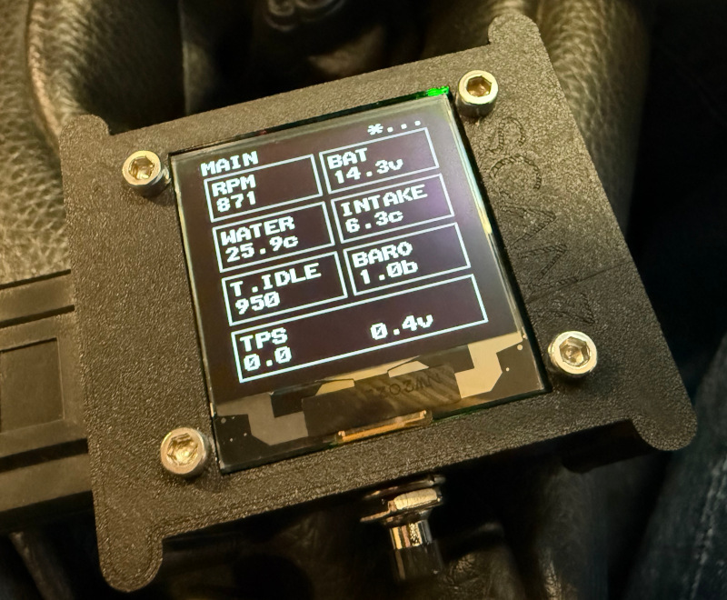

# SCAN7

This is Arduino source-code for a device that plugs into the OBD port on
certain models of Caterham Seven, talks to the MBE ECU, and displays a few
pages of diagnostics on its little screen. It should (hopefully) be useful for
debugging sensor problems and for maintenance jobs like resetting the
throttle position sensor.

The hardware is a
[CANBed RP2040](https://thepihut.com/products/canbed-arduino-can-bus-rp2040-development-board)
development board, coupled to a
[128x128 pixel OLED display](https://thepihut.com/products/1-5-oled-display-module).
This board is nice because it's super-cheap, compact, has a relatively powerful
microcontroller, and has all the electronics needed to interface with the ECU
on a single board.
